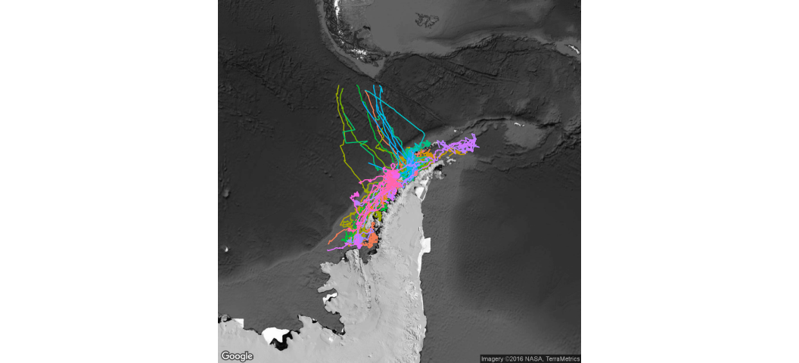
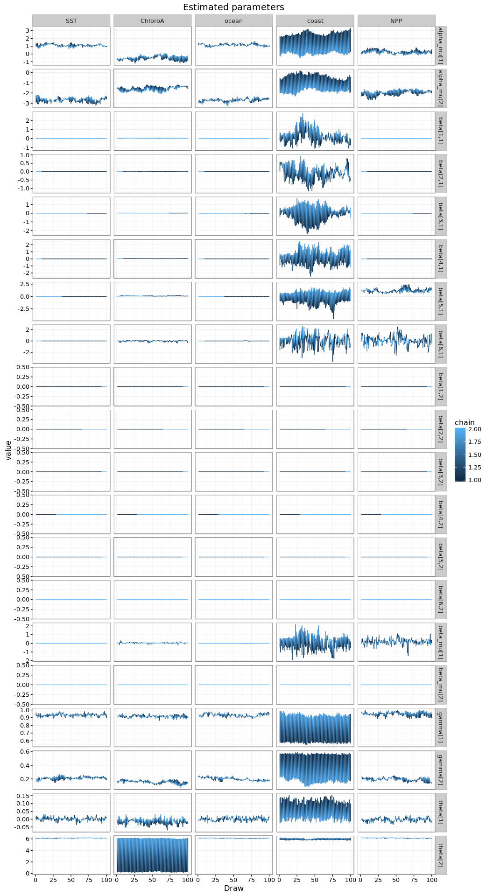
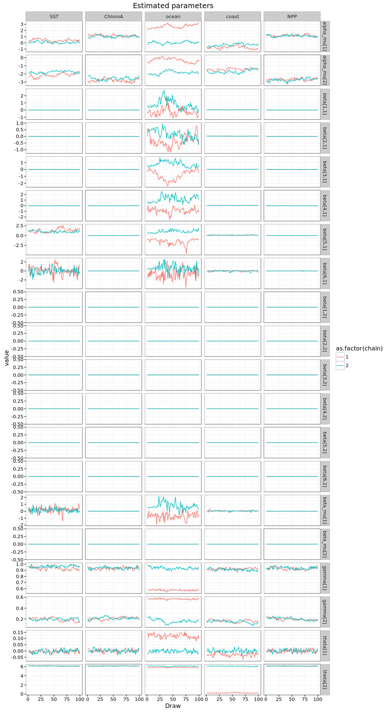
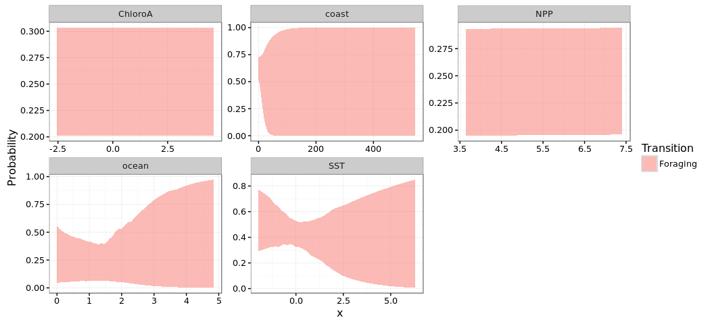
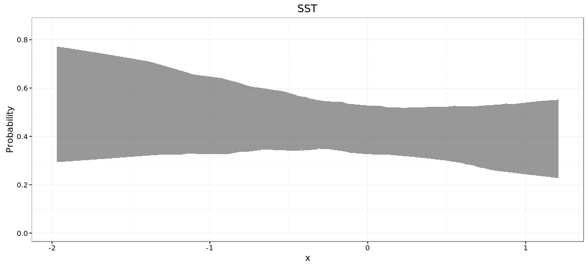
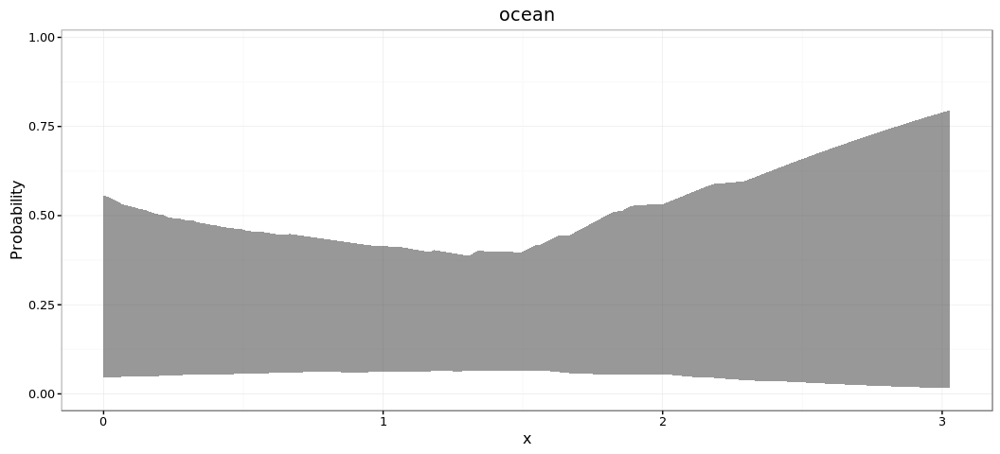

# Antarctic Whale Project: Data Exploration
Ben Weinstein  
`r Sys.time()`  


<!-- -->

##By Month

<!-- -->

#Correlated random walk

*Process Model*

$$ d_{t} \sim T*d_{t-1} + Normal(0,\Sigma)$$
$$ x_t = x_{t-1} + d_{t} $$

## Parameters

For each individual:

$$\theta = \text{Mean turning angle}$$
$$\gamma = \text{Move persistence} $$

For both behaviors process variance is:
$$ \sigma_{latitude} = 0.1$$
$$ \sigma_{longitude} = 0.1$$

##Behavioral States

$$ \text{For each individual i}$$
$$ Behavior_1 = \text{traveling}$$
$$ Behavior_2 = \text{foraging}$$

$$ \alpha_{i,1,1} = \text{Probability of remaining traveling when traveling}$$
$$\alpha_{i,2,1} = \text{Probability of switching from Foraging to traveling}$$

$$\begin{matrix}
  \alpha_{i,1,1} & 1-\alpha_{i,1,1} \\
  \alpha_{i,2,1} & 1-\alpha_{i,2,1} \\
\end{matrix}
$$

##Environment

Behavioral states are a function of local environmental conditions. The first environmental condition is ocean depth. I then build a function for preferential foraging in shallow waters.

It generally follows the form, conditional on behavior at t -1:

$$Behavior_t \sim Multinomial([\phi_{traveling},\phi_{foraging}])$$

With the probability of switching states:

$$logit(\phi_{traveling}) = \alpha_{Behavior_{t-1}} + \beta_{Month,1} * Environment_{y[t,]}$$

$$logit(\phi_{foraging}) = \alpha_{Behavior_{t-1}} $$

Following Bestley in preferring to describe the switch into feeding, but no estimating the resumption of traveling.

The effect of the environment is temporally variable such that

$$ \beta_{Month,2} \sim ~ Normal(\beta_{\mu},\beta_\tau)$$


##Continious tracks

The transmitter will often go dark for 10 to 12 hours, due to weather, right in the middle of an otherwise good track. The model requires regular intervals to estimate the turning angles and temporal autocorrelation. As a track hits one of these walls, call it the end of a track, and begin a new track once the weather improves. We can remove any micro-tracks that are less than three days.
Specify a duration, calculate the number of tracks and the number of removed points. Iteratively.


How did the filter change the extent of tracks?

<!-- -->

#Environmental Models

Looping through each covariate.

* Bathymetry
* Distance to coast
* Sea surface temperature
* Chlorophyl A
* Wave Height
* Primary Productivity
* Sea Ice Cover (%)


##Chains
<!-- -->

<!-- -->

## Parameter Summary
<!-- -->

## Which estimates do not overlap with zero?


```
##         L1        par Significant
## 1      SST  beta[4,1]        TRUE
## 2      SST  beta[5,1]        TRUE
## 3  ChloroA  beta[3,1]        TRUE
## 4    ocean  beta[2,1]        TRUE
## 5    ocean  beta[4,1]        TRUE
## 6    ocean  beta[5,1]        TRUE
## 7    coast  beta[5,1]        TRUE
## 8      NPP  beta[2,1]        TRUE
## 9      NPP  beta[4,1]        TRUE
## 10     NPP  beta[5,1]        TRUE
## 11     NPP beta_mu[1]        TRUE
```

#Behavior and environment

##Hierarchical 

<!-- --><!-- -->

### Zoom in


```
## [[1]]
```

<!-- -->

```
## 
## [[2]]
```

<!-- -->

```
## 
## [[3]]
```

<!-- -->

```
## 
## [[4]]
```

<!-- -->

```
## 
## [[5]]
```

<!-- -->


```
## [[1]]
```

<!-- -->

```
## 
## [[2]]
```

<!-- -->

```
## 
## [[3]]
```

<!-- -->

```
## 
## [[4]]
```

<!-- -->

```
## 
## [[5]]
```

<!-- -->

## By Month

<!-- --><!-- --><!-- --><!-- -->


```
##                            Type     Size     PrettySize  Rows Columns
## mdat                 data.frame 26982544  [1] "25.7 Mb" 57230      59
## m                         ggmap 13116432  [1] "12.5 Mb"  1280    1280
## d        SpatialPointsDataFrame  2516368   [1] "2.4 Mb"  5389      66
## oxy                  data.frame  2427056   [1] "2.3 Mb"  5389      66
## monthall             data.frame  1513456   [1] "1.4 Mb" 29036       8
## sxy                        list  1318080   [1] "1.3 Mb"     9      NA
## mxy                      tbl_df  1216312   [1] "1.2 Mb"  2569      69
## pc                   data.frame   646664 [1] "631.5 Kb" 16000       9
## p                          list   611184 [1] "596.9 Kb"     5      NA
## pribbon                    list   611184 [1] "596.9 Kb"     5      NA
```

```
##           used (Mb) gc trigger  (Mb) max used  (Mb)
## Ncells 1532719 81.9    3886542 207.6  3886542 207.6
## Vcells 8174541 62.4   31069088 237.1 59796647 456.3
```
